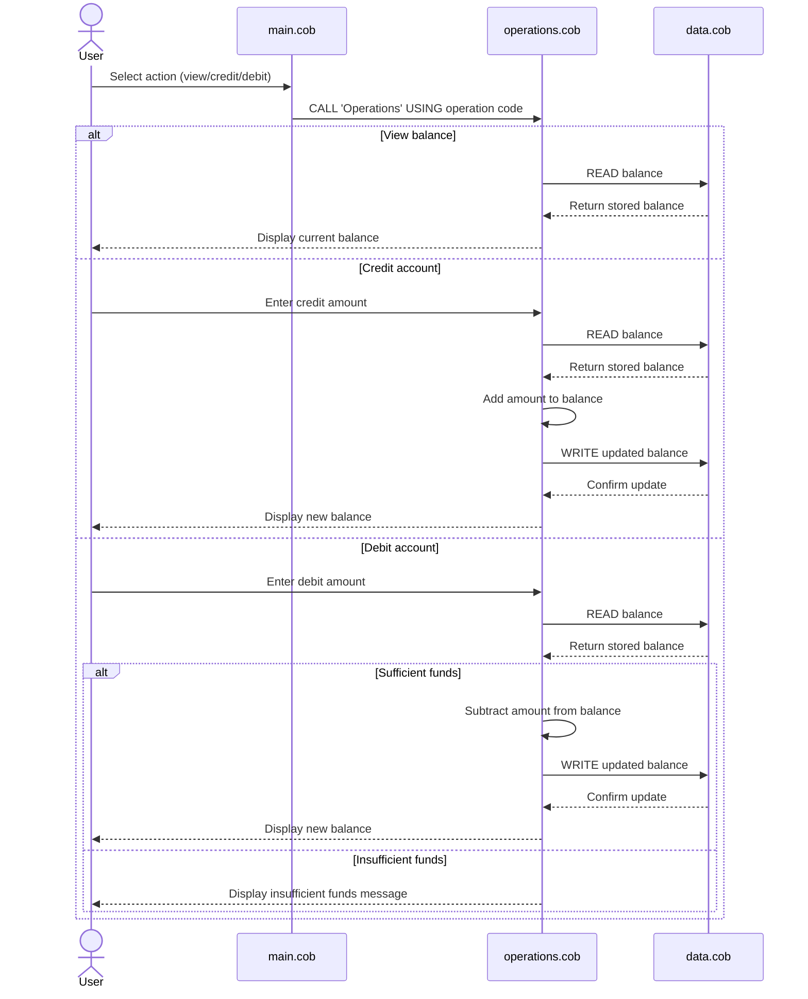

# COBOL Account Management Overview

This directory documents the simple COBOL account-management sample used in this repository. The program models a basic student account workflow with balance inquiry, deposits, withdrawals, and simple persistence of the current balance.

## File purposes

### main.cob
Purpose:
- Serves as the entry point for the application.
- Presents a menu to the user with four options: view balance, credit account, debit account, and exit.
- Routes the selected action to the operations program.

Key functions:
- Displays the main menu.
- Accepts the user's numeric choice.
- Calls the operations program with one of three operation codes: `TOTAL `, `CREDIT`, or `DEBIT `.

### operations.cob
Purpose:
- Implements the core account actions for balance lookup, crediting, and debiting.
- Acts as the business logic layer for the account operations.

Key functions:
- Handles the `TOTAL ` operation by reading and displaying the current balance.
- Handles the `CREDIT` operation by prompting for an amount, reading the existing balance, adding the amount, writing the updated balance, and displaying the result.
- Handles the `DEBIT ` operation by prompting for an amount, reading the existing balance, and only applying the withdrawal if sufficient funds are available.

### data.cob
Purpose:
- Provides the data access layer for the balance value.
- Stores the current balance in working storage and returns or updates it based on the requested operation.

Key functions:
- Supports `READ` by returning the stored balance.
- Supports `WRITE` by updating the stored balance.

## Business rules for the student account sample

The current COBOL implementation reflects a small set of basic account rules:

- The account starts with an initial balance of 1000.00.
- Credits increase the balance.
- Debits decrease the balance only when the requested amount is less than or equal to the current balance.
- If a debit exceeds the available balance, the system displays an "Insufficient funds for this debit." message and does not reduce the balance.
- All money values are stored with two decimal places.

## Notes

This example is intentionally simple and does not yet include more advanced student-account features such as account IDs, student-specific fees, overdraft limits, or persistent storage outside the running program.

## Sequence diagram

